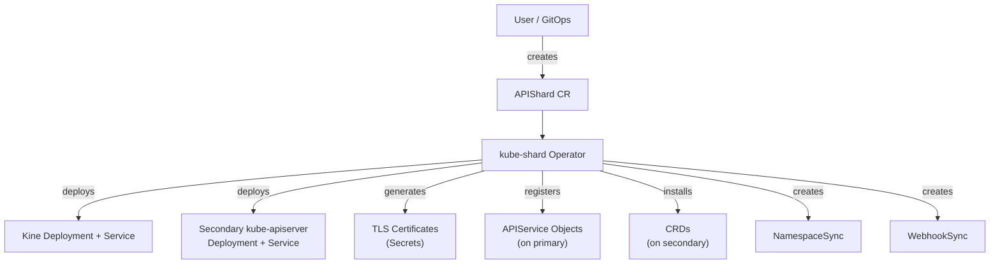
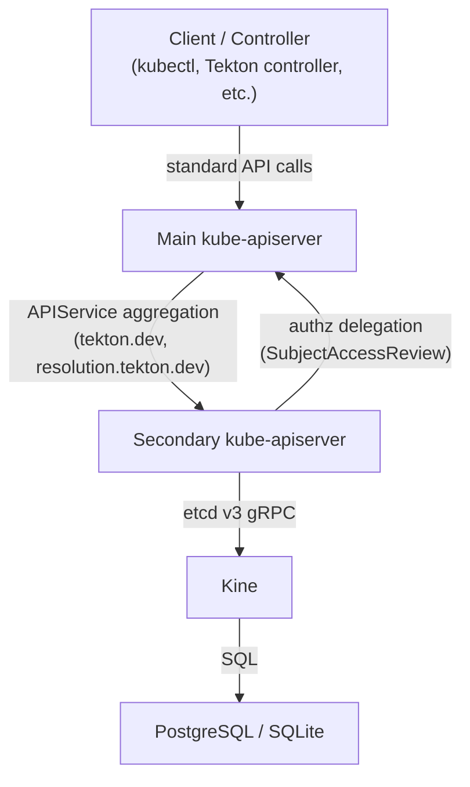

# kube-shard

An aggregated Kubernetes API server backed by [Kine](https://github.com/k3s-io/kine) (PostgreSQL/SQLite/MySQL) instead of etcd. Offloads CRDs from the main cluster's etcd to eliminate storage size constraints.

## What it does

kube-shard runs a secondary `kube-apiserver` on a Kubernetes cluster, backed by PostgreSQL (or SQLite for development). The main cluster's kube-apiserver forwards requests for configured API groups to kube-shard via [API aggregation](https://kubernetes.io/docs/concepts/extend-kubernetes/api-extension/apiserver-aggregation/) (APIService resources).

Controllers and clients are unaware of the split -- they talk to the main kube-apiserver as usual, and aggregation transparently routes requests to the correct backend.

**CRD coexistence:** By default (`forceAggregation: true`), the operator overrides the kube-aggregator's auto-register controller so that APIService objects for offloaded groups remain effective even when CRDs for the same groups exist on the primary. This means existing CRDs do not need to be removed before enabling aggregation. Set `forceAggregation: false` if you prefer the operator to block and require manual CRD removal instead.

## Why

Etcd has a hard 8 GB storage limit. For workloads that generate large, high-churn CRDs (e.g., Tekton PipelineRuns, TaskRuns), this becomes the primary bottleneck on cluster capacity. PostgreSQL has no practical size limit for these workloads.

## Architecture

### Operator Flow

The kube-shard operator watches `APIShard` custom resources and reconciles the full stack:



### Request Flow

Once deployed, API requests are transparently routed via Kubernetes aggregation:



## Status

Operator-managed deployment. See [docs/design.md](docs/design.md) for the full design document.

## Getting Started

### Prerequisites

- [kubectl](https://kubernetes.io/docs/tasks/tools/)
- Docker or Podman
- Access to a Kubernetes cluster

### Deploy the Operator

From the `operator/` directory:

```bash
# Install CRDs
make install

# Build and push the operator image
make docker-build docker-push IMG=<your-registry>/kube-shard-operator:latest

# Deploy the operator
make deploy IMG=<your-registry>/kube-shard-operator:latest
```

### Create an APIShard

Apply an `APIShard` CR to offload API groups to a secondary server. Example with in-cluster PostgreSQL:

```yaml
apiVersion: kube-shard.konflux-ci.dev/v1alpha1
kind: APIShard
metadata:
  name: tekton-shard
spec:
  targetNamespace: kube-shard-operator
  apiGroups:
  - group: tekton.dev
    versions: ["v1", "v1beta1"]
  - group: resolution.tekton.dev
    versions: ["v1beta1"]
  storage:
    type: InClusterPostgreSQL
    inCluster:
      resources:
        requests:
          cpu: 100m
          memory: 256Mi
        limits:
          memory: 512Mi
  namespaceSync:
    labelSelector:
      matchLabels:
        konflux.dev/type: tenant
  secondary:
    replicas: 1
    image: registry.k8s.io/kube-apiserver:v1.32.0
  kine:
    replicas: 1
    image: rancher/kine:v0.14.14
```

For development with SQLite (no external database needed):

```yaml
apiVersion: kube-shard.konflux-ci.dev/v1alpha1
kind: APIShard
metadata:
  name: tekton-shard-dev
spec:
  targetNamespace: kube-shard-operator
  apiGroups:
  - group: tekton.dev
    versions: ["v1"]
  storage:
    type: SQLite
  namespaceSync:
    labelSelector:
      matchLabels:
        konflux.dev/type: tenant
  secondary:
    replicas: 1
  kine:
    replicas: 1
```

### Check Status

```bash
kubectl get apishards
kubectl get apishard tekton-shard -o yaml
```

### Uninstall

```bash
# Delete the APIShard CR (tears down the secondary stack)
kubectl delete apishard tekton-shard

# Remove operator and CRDs
cd operator
make undeploy
make uninstall
```

## Custom Resources

The operator defines three CRDs:

| CRD | Scope | Purpose |
|-----|-------|---------|
| `APIShard` | Cluster | Deploys a secondary kube-apiserver + Kine stack and registers APIService objects |
| `NamespaceSync` | Namespaced | Syncs namespaces from primary to secondary based on a label selector |
| `WebhookSync` | Namespaced | Mirrors admission webhooks for sharded API groups to the secondary |

### APIShard Spec Fields

| Field | Description |
|-------|-------------|
| `targetNamespace` | Namespace where the secondary stack is deployed |
| `apiGroups` | List of API groups and versions to offload |
| `storage.type` | Backend: `SQLite`, `InClusterPostgreSQL`, or `PostgreSQL` (external) |
| `storage.connectionSecretRef` | Secret reference for external PostgreSQL connection string |
| `namespaceSync.labelSelector` | Label selector for namespaces to sync to the secondary |
| `secondary.replicas` | Replica count for the secondary kube-apiserver |
| `secondary.image` | Container image for kube-apiserver |
| `kine.replicas` | Replica count for Kine |
| `kine.image` | Container image for Kine |
| `forceAggregation` | Override kube-aggregator auto-register controller to allow CRD coexistence (default: `true`) |

## Development

```bash
cd operator

# Run unit tests
make test

# Run e2e tests (requires a running cluster)
make test-e2e

# Generate manifests and code after API changes
make manifests generate

# Run the operator locally (outside cluster)
make run
```

## Legacy PoC Scripts (Deprecated)

The shell scripts in `hack/` and Kustomize manifests in `deploy/poc/` are the original proof-of-concept automation. They are kept for reference only. The operator supersedes them entirely.

See [AGENTS.md](AGENTS.md) for details on the legacy PoC structure.

## License

Apache-2.0
