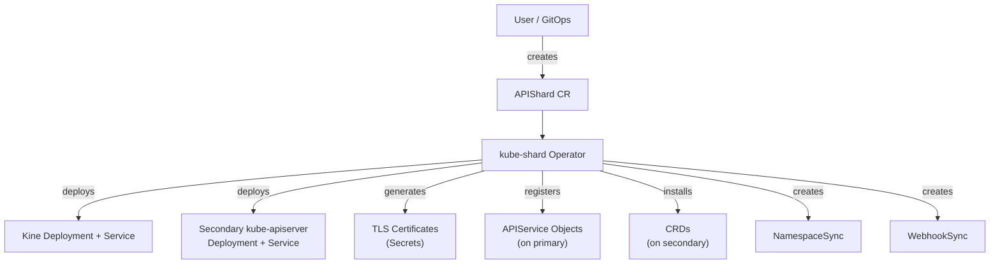
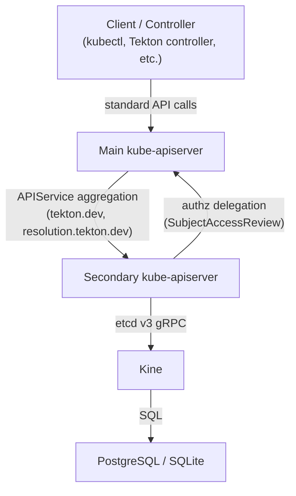

# kube-shard

An aggregated Kubernetes API server backed by [Kine](https://github.com/k3s-io/kine) (PostgreSQL/SQLite/MySQL) instead of etcd. Offloads CRDs from the main cluster's etcd to eliminate storage size constraints.

## What it does

kube-shard runs a secondary `kube-apiserver` on a Kubernetes cluster, backed by PostgreSQL (or SQLite for development). The main cluster's kube-apiserver forwards requests for configured API groups to kube-shard via [API aggregation](https://kubernetes.io/docs/concepts/extend-kubernetes/api-extension/apiserver-aggregation/) (APIService resources).

Controllers and clients are unaware of the split -- they talk to the main kube-apiserver as usual, and aggregation transparently routes requests to the correct backend.

**CRD coexistence:** By default (`forceAggregation: true`), the operator overrides the kube-aggregator's auto-register controller so that APIService objects for offloaded groups remain effective even when CRDs for the same groups exist on the primary. This means existing CRDs do not need to be removed before enabling aggregation. Set `forceAggregation: false` if you prefer the operator to block and require manual CRD removal instead.

## Why

Etcd has a hard 8 GB storage limit. For workloads that generate large, high-churn CRDs (e.g., Tekton PipelineRuns, TaskRuns), this becomes the primary bottleneck on cluster capacity. PostgreSQL has no practical size limit for these workloads.

## Architecture

### Operator Flow

The kube-shard operator watches `APIShard` custom resources and reconciles the full stack:



### Request Flow

Once deployed, API requests are transparently routed via Kubernetes aggregation:



## Status

Operator-managed deployment. See [docs/design.md](docs/design.md) for the full design document.

## Getting Started

### Prerequisites

- [kubectl](https://kubernetes.io/docs/tasks/tools/)
- Docker or Podman
- Access to a Kubernetes cluster

### Deploy the Operator

From the `operator/` directory:

```bash
# Install CRDs
make install

# Build and push the operator image
make docker-build docker-push IMG=<your-registry>/kube-shard-operator:latest

# Deploy the operator
make deploy IMG=<your-registry>/kube-shard-operator:latest
```

### Create an APIShard

Apply an `APIShard` CR to offload API groups to a secondary server. Example with in-cluster PostgreSQL:

```yaml
apiVersion: kube-shard.konflux-ci.dev/v1alpha1
kind: APIShard
metadata:
  name: tekton-shard
spec:
  targetNamespace: kube-shard-operator
  apiGroups:
  - group: tekton.dev
    versions: ["v1", "v1beta1"]
  - group: resolution.tekton.dev
    versions: ["v1beta1"]
  storage:
    type: InClusterPostgreSQL
    inCluster:
      resources:
        requests:
          cpu: 100m
          memory: 256Mi
        limits:
          memory: 512Mi
  namespaceSync:
    labelSelector:
      matchLabels:
        konflux.dev/type: tenant
  secondary:
    replicas: 1
    image: registry.k8s.io/kube-apiserver:v1.36.2
  kine:
    replicas: 1
    image: ghcr.io/k3s-io/kine:v0.16.3
```

For development with SQLite (no external database needed):

```yaml
apiVersion: kube-shard.konflux-ci.dev/v1alpha1
kind: APIShard
metadata:
  name: tekton-shard-dev
spec:
  targetNamespace: kube-shard-operator
  apiGroups:
  - group: tekton.dev
    versions: ["v1"]
  storage:
    type: SQLite
  namespaceSync:
    labelSelector:
      matchLabels:
        konflux.dev/type: tenant
  secondary:
    replicas: 1
  kine:
    replicas: 1
```

### Check Status

```bash
kubectl get apishards
kubectl get apishard tekton-shard -o yaml
```

### Uninstall

```bash
# Delete the APIShard CR (tears down the secondary stack)
kubectl delete apishard tekton-shard

# Remove operator and CRDs
cd operator
make undeploy
make uninstall
```

## Custom Resources

The operator defines three CRDs:

| CRD | Scope | Purpose |
|-----|-------|---------|
| `APIShard` | Cluster | Deploys a secondary kube-apiserver + Kine stack and registers APIService objects |
| `NamespaceSync` | Namespaced | Syncs namespaces from primary to secondary based on a label selector |
| `WebhookSync` | Namespaced | Mirrors admission webhooks for sharded API groups to the secondary |

### APIShard Spec Fields

| Field | Description |
|-------|-------------|
| `targetNamespace` | Namespace where the secondary stack is deployed |
| `apiGroups` | List of API groups and versions to offload |
| `storage.type` | Backend: `SQLite`, `InClusterPostgreSQL`, or `PostgreSQL` (external) |
| `storage.connectionSecretRef` | Secret reference for external PostgreSQL connection string |
| `namespaceSync.labelSelector` | Label selector for namespaces to sync to the secondary |
| `secondary.replicas` | Replica count for the secondary kube-apiserver |
| `secondary.image` | Container image for kube-apiserver |
| `secondary.resources` | CPU/memory requests and limits for the kube-apiserver container |
| `kine.replicas` | Replica count for Kine |
| `kine.image` | Container image for Kine |
| `kine.resources` | CPU/memory requests and limits for the Kine container |
| `forceAggregation` | Override kube-aggregator auto-register controller to allow CRD coexistence (default: `true`) |

## Resource Sizing and Kine Compaction

Kine translates the Kubernetes etcd v3 API into SQL. Every object update creates a new row in the database (a "revision"). Kine runs a background **compaction** process that deletes old revisions, keeping only the latest version of each object.

### Why compaction matters

Without compaction, the database grows with every update -- not just every new object. A single PipelineRun that receives 5 status updates stores 5 full copies. At scale (thousands of PipelineRuns, each spawning TaskRuns), this causes:

1. **Unbounded database growth** -- the DB can reach many GB even though the live object set is much smaller
2. **Kine OOM kills** -- LIST and WATCH operations buffer results in memory; a large DB means Kine needs proportionally more RAM
3. **A death spiral** -- Kine OOMs → restarts → compaction never completes → DB grows → worse OOMs

### Sizing guidelines

Configure resources via the APIShard CR:

```yaml
spec:
  kine:
    replicas: 3
    resources:
      requests:
        cpu: "2"
        memory: 4Gi
      limits:
        cpu: "2"
        memory: 4Gi
  secondary:
    replicas: 3
    resources:
      requests:
        cpu: "2"
        memory: 4Gi
      limits:
        cpu: "2"
        memory: 4Gi
  storage:
    type: InClusterPostgreSQL
    inCluster:
      resources:
        requests:
          cpu: "1"
          memory: 1Gi
        limits:
          cpu: "1"
          memory: 1Gi
```

Key considerations:

- **Set requests equal to limits** (Guaranteed QoS) for Kine and the apiserver to avoid OOM kills under load.
- **Kine memory** must be large enough to buffer the largest LIST response. If your largest API group contains N objects of average size S, Kine needs at least `N * S` of headroom on top of its base usage.
- **Multiple Kine replicas** distribute LIST/WATCH load across instances.
- **PostgreSQL** is less memory-sensitive but benefits from enough RAM to cache the working set.

### Load testing

The `hack/loadtest/` directory contains scripts to stress-test storage capacity:

```bash
# Create 1000 PipelineRuns (~100KB each, 10 tasks per PR, 10 in parallel)
./hack/loadtest/run-loadtest.sh 1000 100 10 10
```

Monitor DB size during the test:

```bash
kubectl exec deployment/<shard>-postgresql -n <namespace> -- \
  psql -U kine -d kine -c "SELECT pg_size_pretty(pg_database_size('kine')) AS db_size, count(*) AS rows FROM kine;"
```

### Load test results

**Test configuration:** 1000 PipelineRuns (~100 KB each, 10 tasks per PR, 1-5 steps per task with random sleep 20-300s). Cluster: OpenShift 4.21, 3 masters (4 CPU / 16 GB), 8 workers. Shard: 3 Kine replicas (24 Gi / 6 CPU), 3 secondary apiservers (24 Gi / 6 CPU), PostgreSQL (2 Gi / 2 CPU). `event-ttl=5m` configured on the primary API server.

#### Storage timeline

| Phase | PostgreSQL | Live rows | etcd (primary) | Notes |
|-------|-----------|-----------|----------------|-------|
| Baseline | 3,960 MB | 35,692 | 155 MB | Pre-test (includes TOAST bloat from prior cleanup) |
| +4 min (1000 PRs created) | 4,568 MB | 42,535 | 370 MB | All PipelineRuns submitted, 4.4/s create rate |
| +12 min | 5,072 MB | 48,801 | 610 MB | Tekton expanding TaskRuns + pods |
| +27 min | 6,651 MB | 71,067 | 740 MB | Near peak -- most TaskRuns created |
| +35 min (peak) | 6,911 MB | 73,693 | 771 MB | etcd plateaus as event-ttl prunes old events |
| +38 min (outage) | -- | -- | -- | Master node NotReady (CPU starvation, see below) |
| +60 min (recovery) | 6,946 MB | 77,058 | 553 MB | etcd compacted; system recovering |
| +90 min (peak rows) | 7,918 MB | 86,542 | 638 MB | Compaction starts catching up |
| +3 hours | 7,918 MB | 55,000 | 582 MB | Compaction actively cleaning |
| +5 hours (steady) | 7,837 MB | 12,200 | 150 MB | Fully compacted |

#### Key findings

**etcd impact (primary cluster):**
- **Without event-ttl tuning** (previous test): etcd peaked at **~2 GB** from TaskRun pods + events
- **With event-ttl=5m**: etcd peaked at **771 MB** (62% reduction) and returned to 150 MB baseline
- Pods and their events are the primary etcd consumers; PipelineRuns/TaskRuns are offloaded to PostgreSQL

**PostgreSQL (shard storage):**
- DB size reached 7.9 GB but this is misleading -- **6.6 GB is TOAST bloat** from prior test cleanup (dead rows that `VACUUM FULL` would reclaim but regular autovacuum does not)
- Actual live data: ~21 MB heap + TOAST for ~12,000 live objects
- Compaction reduced rows from 86,542 (peak) to ~12,200 (steady state) within ~4 hours
- `VACUUM FULL` or `pg_repack` recommended for production to reclaim TOAST space

**Incident: master node CPU starvation:**
- One master (4 CPU / 16 GB) became NotReady at ~35 min into the test
- Root cause: CPU load average hit **101** on 4 CPUs. etcd (1.3 GB RSS) + kube-apiserver (2.6 GB RSS) + event-ttl GC consumed all CPU
- CRI-O and kubelet froze (futex_wait), PLEG went unhealthy, node marked NotReady
- Cluster survived on remaining 2 masters; node self-recovered after ~15 min
- **Takeaway**: `event-ttl=5m` is too aggressive for 4-CPU masters under burst load. Consider 15-30m, or use larger masters

**PipelineRun outcomes:**
- 42/1000 succeeded (completed within default 1h timeout)
- 958/1000 timed out (sequential steps with random 20-300s sleep exceeded the 1h default)

## Development

```bash
cd operator

# Run unit tests
make test

# Run e2e tests (requires a running cluster)
make test-e2e

# Generate manifests and code after API changes
make manifests generate

# Run the operator locally (outside cluster)
make run
```

## Legacy PoC Scripts (Deprecated)

The shell scripts in `hack/` and Kustomize manifests in `deploy/poc/` are the original proof-of-concept automation. They are kept for reference only. The operator supersedes them entirely.

See [AGENTS.md](AGENTS.md) for details on the legacy PoC structure.

## License

Apache-2.0
