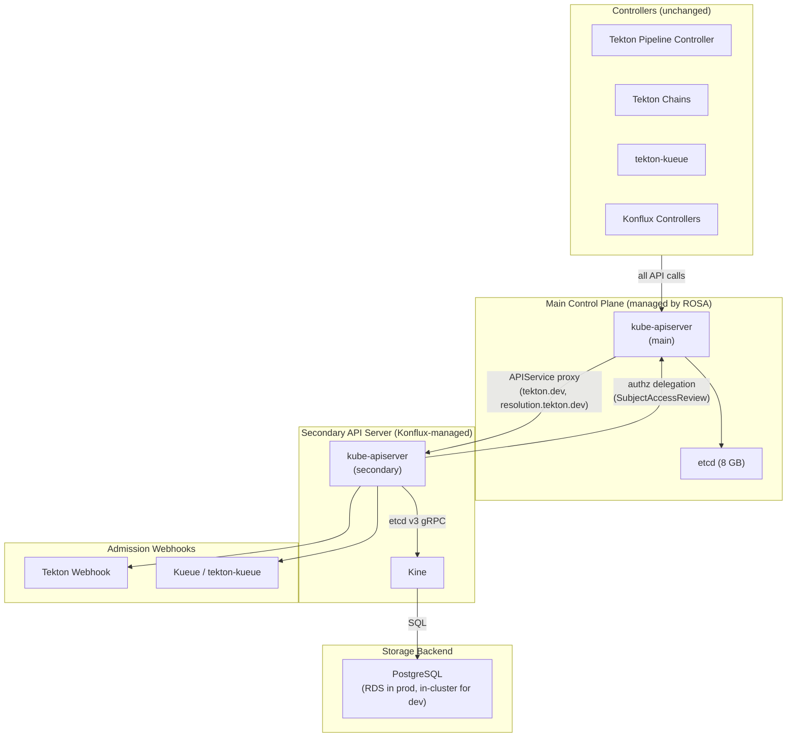

# Secondary API Server for Tekton CRDs (Kine + PostgreSQL)

## Summary

Eliminate the etcd 8 GB size constraint on per-cluster PipelineRun concurrency by running a secondary kube-apiserver backed by PostgreSQL (via [Kine](https://github.com/k3s-io/kine)). Tekton CRDs are installed on the secondary server, and the main kube-apiserver routes `tekton.dev` and `resolution.tekton.dev` requests to it via Kubernetes API aggregation (APIService).

This removes the ~300 concurrent PipelineRun ceiling without waiting for upstream CRD sharding support (uncertain, 12-18+ months) or requiring ROSA HCP migration. PostgreSQL has no practical size limit for this workload, enabling 1000+ concurrent PipelineRuns per cluster.

## Problem Statement

Etcd's 8 GB memory limit is the primary ceiling on per-cluster PipelineRun concurrency. Each PipelineRun with ~22 TaskRuns consumes ~23 MB of etcd storage (accounting for revisions from multiple controllers updating status). At ~300 concurrent PipelineRuns, the cluster approaches the 8 GB limit.

The upstream Kubernetes effort to support CRD sharding via `--etcd-servers-overrides` is at a very early stage ([kubernetes/kubernetes#118858](https://github.com/kubernetes/kubernetes/issues/118858), [PR #139883](https://github.com/kubernetes/kubernetes/pull/139883)) and is currently on hold. Optimistically 12-18 months from agreement; pessimistically not at all.

Etcd sharding by resource kind (Events, Leases, Pods) is available via HyperShift but only for built-in Kubernetes resources -- CRDs cannot be sharded. This approach bypasses both limitations using existing, proven mechanisms.

## Architecture



### Key Design Properties

- **Controllers don't change.** They talk to the main kube-apiserver using their normal ServiceAccount tokens. API aggregation transparently routes `tekton.dev` and `resolution.tekton.dev` requests to the secondary server.
- **No etcd size limit.** PostgreSQL can handle hundreds of GB. The per-cluster PipelineRun ceiling becomes compute-bound, not storage-bound.
- **Works on ROSA Classic today.** APIService is standard Kubernetes API; no HCP migration or platform changes required.
- **Complements other scaling strategies.** Orthogonal to MultiKueue, etcd sharding (built-in resources), and per-PipelineRun footprint reduction. Can be combined with any of them.

### Resource Placement

| Resource | Location | Notes |
|----------|----------|-------|
| PipelineRun, TaskRun, Pipeline, Task, StepAction, CustomRun | Secondary → PostgreSQL | No etcd involvement |
| ResolutionRequest | Secondary → PostgreSQL | Short-lived, created per pipeline run |
| Pods, ConfigMaps, Secrets, Events, Leases | Main → etcd | Unchanged |
| Namespaces | Both (mirrored) | Sync controller copies from main → secondary |
| Konflux CRDs (Snapshot, Release) | Phase 2: Secondary → PostgreSQL | Start with Tekton only |

## Secondary API Server Configuration

The secondary kube-apiserver runs as a Deployment in a dedicated namespace (`tekton-apiserver`) on the Konflux cluster.

### Key Flags

| Flag | Value | Rationale |
|------|-------|-----------|
| `--etcd-servers` | `http://kine.tekton-apiserver.svc:2379` | Kine endpoint (in-cluster) |
| `--authorization-mode` | `Webhook` | Delegates authz to main cluster |
| `--authorization-webhook-config-file` | `/etc/kube/authz-webhook.yaml` | Points to main cluster's SAR endpoint |
| `--requestheader-client-ca-file` | `/etc/kube/front-proxy-ca.crt` | Trust the main KAS identity headers |
| `--requestheader-allowed-names` | `front-proxy-client` | Only accept headers from the main KAS |
| `--disable-admission-plugins` | `NamespaceLifecycle` | Namespaces are mirrored, not authoritative here |
| `--enable-admission-plugins` | `MutatingAdmissionWebhook,ValidatingAdmissionWebhook` | For Tekton/Kueue webhooks |
| `--tls-cert-file` / `--tls-private-key-file` | Serving cert for the Service | TLS between main KAS and secondary |

Note: `--service-account-key-file` is NOT needed on the secondary. The secondary never receives raw ServiceAccount tokens -- the main KAS authenticates all tokens and passes the authenticated identity via request headers. The secondary only trusts these headers (via `--requestheader-client-ca-file`).

For the authz webhook callback (secondary → main KAS SubjectAccessReview), the secondary authenticates to the main cluster using a dedicated ServiceAccount token with `system:auth-delegator` ClusterRoleBinding. This token is specified in the `--authorization-webhook-config-file` kubeconfig.

### What is NOT enabled on the secondary

- No scheduler, no controller-manager, no kubelet integration
- No built-in controllers (garbage collection handled by main cluster's GC through the aggregation layer)
- No service account token issuer (tokens issued by main cluster; secondary validates them)

### Deployment Spec

- **Replicas:** 3 (HA -- loss of a single pod doesn't interrupt service)
- **Resources:** ~2 CPU, ~4 GB memory per replica (to be validated under load)
- **Node placement:** Anti-affinity across availability zones
- **Health checks:** `/livez` and `/readyz` endpoints (built into kube-apiserver)

### Kine Deployment

Kine runs as a separate Deployment in the same namespace, exposing an etcd v3 gRPC endpoint:

- **Replicas:** 2-3 (stateless translator, can scale horizontally)
- **Connection to PostgreSQL:** Standard connection string, TLS enforced, credentials from a Secret

## Authentication and Authorization

**Authentication** is handled entirely by the main kube-apiserver. The main server authenticates the request, then passes the authenticated identity to the secondary via request headers (`X-Remote-User`, `X-Remote-Group`, `X-Remote-Extra-*`). The secondary trusts these headers via `--requestheader-client-ca-file`.

**Authorization** is NOT handled by the main kube-apiserver for aggregated APIs. The main server only checks a coarse proxy-level permission on the APIService, not fine-grained RBAC on the target resource.

The secondary uses `--authorization-mode=Webhook`, delegating every authz decision to the main cluster's SubjectAccessReview API:

1. Request arrives at main KAS → authenticated → proxied to secondary with user identity in headers
2. Secondary receives request → calls SubjectAccessReview on main cluster → "can user X create pipelineruns in namespace foo?"
3. Main cluster evaluates its RBAC rules (same RoleBindings that exist today) → returns allow/deny
4. Secondary proceeds or rejects

RBAC rules remain managed exclusively on the main cluster. No RBAC synchronization is needed.

## Admission Webhooks

The main kube-apiserver does **not** run admission webhooks for aggregated API requests -- it only proxies. The secondary server is responsible for its own admission pipeline.

Tekton's validation/mutation webhooks and Kueue's admission controller need to be registered on the secondary server (as ValidatingWebhookConfiguration/MutatingWebhookConfiguration objects in the secondary's store). They point to the same in-cluster webhook Services, which are reachable from the secondary via cluster DNS.

## Namespace Synchronization

`NamespaceLifecycle` admission is disabled on the secondary. However, the secondary still needs Namespace objects in its store for list/watch to scope correctly.

A lightweight sync controller (running on the main cluster) watches Namespaces and mirrors create/delete to the secondary:

- Watches Namespaces on main → creates/deletes corresponding Namespace on secondary
- Only syncs `metadata.name` and `metadata.labels`
- Uses a label selector (e.g., `konflux.dev/tenant`) to limit scope to tenant namespaces
- Ignores system namespaces (`kube-system`, `openshift-*`, etc.)

**Failure modes:**
- Sync controller behind: new namespaces won't exist on secondary immediately. PipelineRun creation still accepted (NamespaceLifecycle disabled), but list by namespace returns empty until sync catches up.
- Secondary unreachable: sync controller retries with backoff. No data loss.

**Namespace deletion:** When a namespace is deleted on main, the sync controller deletes it on secondary. The main cluster's garbage collector handles cascading deletion of Tekton resources in that namespace (via the aggregation layer).

## Garbage Collection

Garbage collection is handled by the main cluster's `kube-controller-manager`, NOT the secondary. The GC discovers aggregated APIs via discovery, watches resources through the aggregation proxy, and deletes orphans via the same path.

Cross-server ownership chains work correctly:

| Owner (deleted) | Dependent (GC'd) | Mechanism |
|---|---|---|
| PipelineRun → TaskRun | Both on secondary | GC watches/deletes both via aggregation |
| TaskRun → Pod | TaskRun on secondary, Pod on main | GC watches TaskRuns via aggregation, deletes Pods directly |
| Namespace → PipelineRun | Namespace on main, PipelineRun on secondary | Namespace deletion triggers GC of all resources in that namespace |

If the secondary is temporarily unavailable, the GC retries (does not prematurely delete dependents).

## Storage Layer

### Kine

[Kine](https://github.com/k3s-io/kine) translates etcd's gRPC API into SQL operations. It's the same component powering k3s clusters running on PostgreSQL/MySQL/SQLite.

### PostgreSQL (Production -- AWS RDS)

| Property | Value | Rationale |
|----------|-------|-----------|
| Engine | PostgreSQL 15+ | Kine's recommended backend |
| Instance class | `db.r6g.large` (2 vCPU, 16 GB) initially | Right-size based on load testing |
| Storage | 100 GB gp3, auto-scaling | PipelineRun data is transient (TTL'd); steady-state bounded |
| Multi-AZ | Yes | HA with automatic failover |
| Encryption | At rest (KMS) + in transit (TLS) | Standard security posture |
| Backup | Automated daily snapshots, 7-day retention | Recovery from corruption |
| Dedicated instance | Yes (separate from Tekton Results RDS) | Isolate write-heavy Kine from read-heavy Results |

### Deployment Modes

| Environment | Backend | Purpose |
|-------------|---------|---------|
| kind (PoC Phase 1) | Kine + SQLite | Fastest path to validate API aggregation wiring |
| kind (PoC Phase 2) | Kine + in-cluster PostgreSQL | Validate PostgreSQL-specific behavior |
| ROSA staging | Kine + RDS PostgreSQL | Production-representative validation |
| ROSA production | Kine + RDS PostgreSQL (Multi-AZ) | Full production deployment |

### Capacity Estimates

| Concurrent PipelineRuns | Estimated data | PostgreSQL feasibility |
|---|---|---|
| 300 (today's ceiling) | ~7 GB | Trivial |
| 1000 (3x) | ~23 GB | Comfortable |
| 3000 (10x) | ~69 GB | Well within RDS limits |

With Tekton's PipelineRun pruner (TTL-based cleanup), steady-state size is bounded by the retention window.

## API Aggregation Setup

### APIService Registration

One APIService per group/version:

```yaml
apiVersion: apiregistration.k8s.io/v1
kind: APIService
metadata:
  name: v1.tekton.dev
spec:
  group: tekton.dev
  version: v1
  service:
    namespace: tekton-apiserver
    name: tekton-apiserver
  caBundle: <secondary-server-CA>
  groupPriorityMinimum: 1000
  versionPriority: 100
```

Additional APIService objects for:
- `v1beta1.tekton.dev` (if still served)
- `v1beta1.resolution.tekton.dev`
- `v1alpha1.resolution.tekton.dev` (if applicable)

### Migration from CRDs to APIService

CRDs and APIService objects cannot coexist for the same group/version. Migration sequence:

1. **Drain:** Stop pipeline activity (or accept brief disruption)
2. **Export:** Dump live Tekton resources from etcd (non-terminal PipelineRuns/TaskRuns)
3. **Delete CRDs:** Remove Tekton CRDs from main cluster
4. **Deploy secondary:** kube-apiserver + Kine + PostgreSQL; install Tekton CRDs on secondary
5. **Register APIService:** Main cluster routes tekton.dev to secondary
6. **Import:** Restore live resources into secondary via API
7. **Resume:** Controllers reconnect (watches re-establish through aggregation)

For the kind PoC, no migration is needed -- install CRDs only on secondary from the start.

## High Availability and Failure Modes

| Failure | Impact | Recovery |
|---------|--------|----------|
| Secondary KAS pod crash | Remaining replicas serve; transparent | Seconds (pod restart) |
| All secondary KAS pods down | Tekton API calls fail (503); running Pods continue; no new pipelines start | Pod rescheduling (seconds to minutes) |
| Kine crash | Secondary KAS loses backend; API calls fail | Pod restart (seconds) |
| RDS failover | ~60-120s disruption; Kine reconnects | Automatic (RDS-managed) |
| RDS data loss | Total loss of Tekton state | Restore from backup |
| Namespace sync controller down | New namespaces don't propagate; existing operations unaffected | Pod restart |

The blast radius of secondary API server failure is similar to today's etcd failure -- both stop all Tekton operations. This design replaces one critical dependency (managed etcd) with another (Konflux-managed secondary KAS + PostgreSQL), trading a hard size constraint for operational responsibility.

## Risks and Open Questions

| Risk | Severity | Mitigation |
|------|----------|------------|
| **Kine watch performance at scale** -- SQL-polling watch handling 6000+ objects with 5+ concurrent watchers | High | Load test in PoC Phase 3. Kine polling interval is configurable. Upstream k3s benchmarks available. |
| **ROSA compatibility** -- custom APIService registration on managed ROSA | Medium | Standard K8s API; OCP uses it extensively. Validate that ROSA operators don't reconcile/remove user-created APIServices. |
| **OpenShift Pipelines operator conflict** -- operator expects to own Tekton CRDs | High | Overlay that disables CRD management on Konflux clusters. Long-term: operator-native support. |
| **Tekton controller assumptions** -- controllers relying on cross-resource resourceVersion ordering | Medium | Code review of Tekton pipeline controller. Unlikely (informer-based, not direct etcd). |
| **Webhook certificate management** -- Tekton webhook self-generates certs | Medium | Provide certs externally (cert-manager) and disable self-cert logic. |
| **Observability** -- etcd dashboards don't apply; need new PostgreSQL/Kine monitoring | Low | Build dashboards for Kine metrics and RDS CloudWatch. |

## PoC Validation Plan

### Phase 1: Basic wiring (kind + SQLite)

Validate API aggregation works end-to-end with Tekton controllers:

1. Create kind cluster
2. Deploy secondary kube-apiserver with Kine (SQLite)
3. Install Tekton CRDs on secondary only
4. Register APIService objects on main
5. Deploy Tekton Pipeline controller
6. Create PipelineRun → verify runs to completion

**Success criteria:** PipelineRun completes; TaskRuns created; Pods scheduled; GC works.

### Phase 2: Auth and namespace sync (kind + PostgreSQL)

1. Switch to in-cluster PostgreSQL
2. Enable webhook authorization
3. Deploy namespace sync controller
4. Test RBAC enforcement
5. Deploy Tekton Chains -- verify signing

**Success criteria:** RBAC works via delegation; namespaces propagate; Chains signs completed TaskRuns.

### Phase 3: Scale validation (kind or staging)

1. Deploy Kueue + tekton-kueue
2. Generate concurrent PipelineRuns (100, 300, 500, 1000)
3. Measure watch latency, reconciliation time, PostgreSQL throughput, Kine resource usage
4. Compare against etcd-backed baseline
5. Find Kine's breaking point

**Success criteria:** 1000+ concurrent PipelineRuns with <5s reconciliation latency; no watch storms.

### Phase 4: Production readiness (ROSA staging)

1. Deploy on Konflux staging cluster
2. Validate APIService survives cluster operator reconciliation
3. Test OpenShift Pipelines operator coexistence
4. Run real Konflux pipelines (build, integration test)
5. Validate admission webhooks
6. Failover testing

## Deployment Strategy

- **Short term:** Konflux-specific deployment overlay. Remove Tekton CRDs from main cluster via GitOps; deploy secondary API server stack; register APIService objects.
- **Long term:** Change how OpenShift Pipelines deploys on Konflux clusters -- operator-native support for aggregated API server mode.

## Scope

**Phase 1 (initial):** `tekton.dev` and `resolution.tekton.dev` API groups only.

**Phase 2 (future):** Konflux-specific CRDs (Snapshot, Release) moved to the same secondary API server.

**Future exploration:** If proven at scale, this approach could replace KubArchive for storing historical pipeline snapshots and release resources -- the PostgreSQL backend provides native query capabilities without needing a separate archival system.

## Related Work

- [KONFLUX-14236](https://redhat.atlassian.net/browse/KONFLUX-14236) -- Reduce PipelineRun etcd footprint (complementary)
- [KONFLUX-14235](https://redhat.atlassian.net/browse/KONFLUX-14235) -- MultiKueue multicluster scheduling (orthogonal)
- [kubernetes/kubernetes#118858](https://github.com/kubernetes/kubernetes/issues/118858) -- Upstream CRD sharding (this approach bypasses the need)
- [openshift/enhancements#1979](https://github.com/openshift/enhancements/pull/1979) -- Etcd sharding for built-in resources (complementary)
- [k3s-io/kine](https://github.com/k3s-io/kine) -- Etcd API to SQL translation layer
- [Etcd sharding impact analysis](etcd-sharding-impact-analysis.md) -- Analysis of built-in resource sharding via HyperShift
