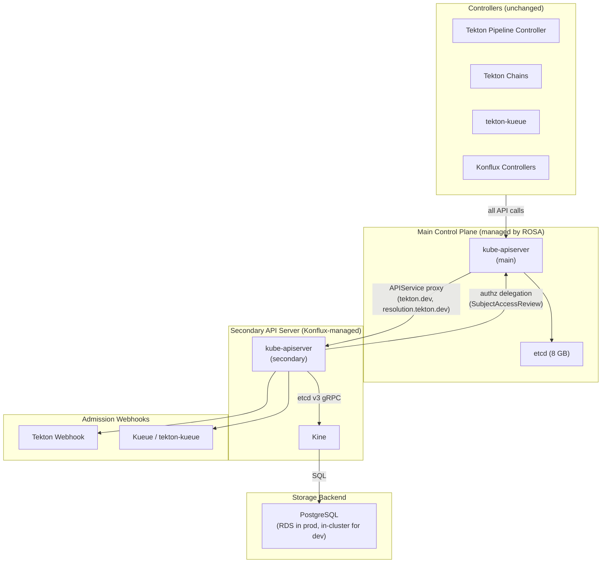

# Secondary API Server for Tekton CRDs (Kine + PostgreSQL)

## Summary

Eliminate the etcd 8 GB size constraint on per-cluster PipelineRun concurrency by running a secondary kube-apiserver backed by PostgreSQL (via [Kine](https://github.com/k3s-io/kine)). Tekton CRDs are installed on the secondary server, and the main kube-apiserver routes `tekton.dev` and `resolution.tekton.dev` requests to it via Kubernetes API aggregation (APIService).

This removes the ~300 concurrent PipelineRun ceiling without waiting for upstream CRD sharding support (uncertain, 12-18+ months) or requiring ROSA HCP migration. PostgreSQL has no practical size limit for this workload, enabling 1000+ concurrent PipelineRuns per cluster.

## Problem Statement

Etcd's 8 GB memory limit is the primary ceiling on per-cluster PipelineRun concurrency. Each PipelineRun with ~22 TaskRuns consumes ~23 MB of etcd storage (accounting for revisions from multiple controllers updating status). At ~300 concurrent PipelineRuns, the cluster approaches the 8 GB limit.

The upstream Kubernetes effort to support CRD sharding via `--etcd-servers-overrides` is at a very early stage ([kubernetes/kubernetes#118858](https://github.com/kubernetes/kubernetes/issues/118858), [PR #139883](https://github.com/kubernetes/kubernetes/pull/139883)) and is currently on hold. Optimistically 12-18 months from agreement; pessimistically not at all.

Etcd sharding by resource kind (Events, Leases, Pods) is available via HyperShift but only for built-in Kubernetes resources -- CRDs cannot be sharded. This approach bypasses both limitations using existing, proven mechanisms.

## Architecture



### Key Design Properties

- **Controllers don't change.** They talk to the main kube-apiserver using their normal ServiceAccount tokens. API aggregation transparently routes `tekton.dev` and `resolution.tekton.dev` requests to the secondary server.
- **No etcd size limit.** PostgreSQL can handle hundreds of GB. The per-cluster PipelineRun ceiling becomes compute-bound, not storage-bound.
- **Works on ROSA Classic today.** APIService is standard Kubernetes API; no HCP migration or platform changes required.
- **Complements other scaling strategies.** Orthogonal to MultiKueue, etcd sharding (built-in resources), and per-PipelineRun footprint reduction. Can be combined with any of them.

### Resource Placement

| Resource | Location | Notes |
|----------|----------|-------|
| PipelineRun, TaskRun, Pipeline, Task, StepAction, CustomRun | Secondary → PostgreSQL | No etcd involvement |
| ResolutionRequest | Secondary → PostgreSQL | Short-lived, created per pipeline run |
| Pods, ConfigMaps, Secrets, Events, Leases | Main → etcd | Unchanged |
| Namespaces | Both (mirrored) | Sync controller copies from main → secondary |
| Konflux CRDs (Snapshot, Release) | Phase 9: Secondary → PostgreSQL | Start with Tekton only |

## Secondary API Server Configuration

The secondary kube-apiserver runs as a Deployment in a dedicated namespace (`tekton-apiserver`) on the Konflux cluster.

### Key Flags

| Flag | Value | Rationale |
|------|-------|-----------|
| `--etcd-servers` | `http://kine.tekton-apiserver.svc:2379` | Kine endpoint (in-cluster) |
| `--authorization-mode` | `Webhook` | Delegates authz to main cluster |
| `--authorization-webhook-config-file` | `/etc/kube/authz/webhook-config.yaml` | Points to main cluster's SAR endpoint |
| `--authorization-webhook-version` | `v1` | Required for k8s 1.36+ (default is v1beta1) |
| `--requestheader-client-ca-file` | `/etc/kube/pki/front-proxy-ca.crt` | Trust the main KAS identity headers |
| `--requestheader-allowed-names` | `front-proxy-client` | Only accept headers from the main KAS |
| `--disable-admission-plugins` | `NamespaceLifecycle,ServiceAccount` | Namespaces are mirrored; SA tokens handled by main |
| `--enable-admission-plugins` | `MutatingAdmissionWebhook,ValidatingAdmissionWebhook` | For Tekton/Kueue webhooks |
| `--tls-cert-file` / `--tls-private-key-file` | Serving cert for the Service | TLS between main KAS and secondary |
| `--service-account-key-file` | SA signing public key | Required by kube-apiserver binary (unused for auth) |

Note: `--service-account-key-file` and `--service-account-signing-key-file` are required by the kube-apiserver binary but not used for authentication. The secondary never validates raw ServiceAccount tokens -- the main KAS authenticates all tokens and passes the authenticated identity via request headers. The secondary only trusts these headers (via `--requestheader-client-ca-file`).

For the authz webhook callback (secondary → main KAS SubjectAccessReview), the secondary pod runs as a ServiceAccount with `system:auth-delegator` ClusterRoleBinding. The webhook kubeconfig references the kubelet-projected token (`tokenFile`) and cluster CA from the pod's mounted service account volume -- no manual token management required.

### What is NOT enabled on the secondary

- No scheduler, no controller-manager, no kubelet integration
- No built-in controllers (garbage collection handled by main cluster's GC through the aggregation layer)
- No service account token validation (tokens authenticated by main cluster; secondary receives identity via request headers)

### Deployment Spec

- **Replicas:** 3 (HA -- loss of a single pod doesn't interrupt service)
- **Resources:** ~2 CPU, ~4 GB memory per replica (to be validated under load)
- **Node placement:** Anti-affinity across availability zones
- **Health checks:** `/livez` and `/readyz` endpoints (built into kube-apiserver)

### Kine Deployment

Kine runs as a separate Deployment in the same namespace, exposing an etcd v3 gRPC endpoint:

- **Replicas:** 2-3 (stateless translator, can scale horizontally)
- **Connection to PostgreSQL:** Standard connection string, TLS enforced, credentials from a Secret

## Authentication and Authorization

**Authentication** is handled entirely by the main kube-apiserver. The main server authenticates the request, then passes the authenticated identity to the secondary via request headers (`X-Remote-User`, `X-Remote-Group`, `X-Remote-Extra-*`). The secondary trusts these headers via `--requestheader-client-ca-file`.

**Authorization** is NOT handled by the main kube-apiserver for aggregated APIs. The main server only checks a coarse proxy-level permission on the APIService, not fine-grained RBAC on the target resource.

The secondary uses `--authorization-mode=Webhook`, delegating every authz decision to the main cluster's SubjectAccessReview API:

1. Request arrives at main KAS → authenticated → proxied to secondary with user identity in headers
2. Secondary receives request → calls SubjectAccessReview on main cluster → "can user X create pipelineruns in namespace foo?"
3. Main cluster evaluates its RBAC rules (same RoleBindings that exist today) → returns allow/deny
4. Secondary proceeds or rejects

RBAC rules remain managed exclusively on the main cluster. No RBAC synchronization is needed.

## Admission Webhooks

The main kube-apiserver does **not** run admission webhooks for aggregated API requests -- it only proxies. The secondary server is responsible for its own admission pipeline.

Tekton's validation/mutation webhooks and Kueue's admission controller need to be registered on the secondary server (as ValidatingWebhookConfiguration/MutatingWebhookConfiguration objects in the secondary's store). They point to the same in-cluster webhook Services, which are reachable from the secondary via cluster DNS.

### caBundle synchronization

The Tekton webhook controller self-manages its TLS CA and injects the `caBundle` into webhook configurations and CRD conversion specs -- but only on objects in the **primary's** store. The secondary receives these objects via a copy/sync mechanism:

1. The setup script extracts fully-configured webhook configs (with `caBundle` already injected) from the primary
2. Applies them to the secondary's store
3. Patches CRDs on the secondary with the same `caBundle` for conversion webhook connectivity

**Cert rotation risk:** The Tekton webhook may rotate its CA on pod restart. When this happens, the `caBundle` on the secondary becomes stale and webhook calls (both admission and CRD conversion) will fail with TLS errors.

**Future automation (kube-shard-operator):** In production, the kube-shard-operator (see Phase 6) will watch webhook configurations on the primary and automatically mirror `caBundle` changes to the secondary. For the PoC, re-running `make phase3` after a Tekton webhook restart is sufficient.

### CRD conversion webhooks

Tekton CRDs declare `v1beta1` as a served version with `spec.conversion.strategy: Webhook`, pointing at `tekton-pipelines-webhook`. However, the Tekton webhook server does **not** implement a conversion endpoint (responds with "no controller registered for: /"). This means CRD conversion is non-functional regardless of how the webhook is configured.

The Phase 3 setup disables these non-functional conversion webhooks by setting `spec.conversion.strategy: None` on all Tekton CRDs on the secondary. Only v1 (the stored version) is actively used.

### Webhook `clientConfig.service` vs `url`

When a webhook config uses `clientConfig.service`, the API server looks up the Service object in its **own** store (not via DNS). Since the secondary doesn't have `tekton-pipelines-webhook` Service in its store, service-based webhook references fail.

The Phase 3 setup transforms all `clientConfig.service` references to `clientConfig.url` (e.g., `https://tekton-pipelines-webhook.tekton-pipelines.svc:443/defaulting`). URL-based references use standard DNS resolution, which works because the secondary pod is in the same cluster and can resolve cluster-internal Service names.

## Namespace Synchronization

`NamespaceLifecycle` admission is disabled on the secondary. However, the secondary still needs Namespace objects in its store for list/watch to scope correctly.

A lightweight sync controller (running on the main cluster) watches Namespaces and mirrors create/delete to the secondary. This will be one reconciliation loop of the **kube-shard-operator** (a Kubebuilder-based operator that owns the full lifecycle of the secondary API server):

- Watches Namespaces on main → creates/deletes corresponding Namespace on secondary
- Only syncs `metadata.name` and `metadata.labels`
- Uses a label selector (e.g., `konflux.dev/tenant`) to limit scope to tenant namespaces
- Ignores system namespaces (`kube-system`, `openshift-*`, etc.)

The kube-shard-operator will also handle webhook config sync, CRD management, APIService registration, and secondary lifecycle management -- consolidating all sync/management concerns into a single operator.

**Failure modes:**
- Sync controller behind: new namespaces won't exist on secondary immediately. PipelineRun creation still accepted (NamespaceLifecycle disabled), but list by namespace returns empty until sync catches up.
- Secondary unreachable: sync controller retries with backoff. No data loss.

**Namespace deletion:** When a namespace is deleted on main, the sync controller deletes it on secondary. The main cluster's garbage collector handles cascading deletion of Tekton resources in that namespace (via the aggregation layer).

## Garbage Collection

Garbage collection is handled by the main cluster's `kube-controller-manager`, NOT the secondary. The GC discovers aggregated APIs via discovery, watches resources through the aggregation proxy, and deletes orphans via the same path.

Cross-server ownership chains work correctly:

| Owner (deleted) | Dependent (GC'd) | Mechanism |
|---|---|---|
| PipelineRun → TaskRun | Both on secondary | GC watches/deletes both via aggregation |
| TaskRun → Pod | TaskRun on secondary, Pod on main | GC watches TaskRuns via aggregation, deletes Pods directly |
| Namespace → PipelineRun | Namespace on main, PipelineRun on secondary | Namespace deletion triggers GC of all resources in that namespace |

If the secondary is temporarily unavailable, the GC retries (does not prematurely delete dependents).

## Storage Layer

### Kine

[Kine](https://github.com/k3s-io/kine) translates etcd's gRPC API into SQL operations. It's the same component powering k3s clusters running on PostgreSQL/MySQL/SQLite.

### PostgreSQL (Production -- AWS RDS)

| Property | Value | Rationale |
|----------|-------|-----------|
| Engine | PostgreSQL 15+ | Kine's recommended backend |
| Instance class | `db.r6g.large` (2 vCPU, 16 GB) initially | Right-size based on load testing |
| Storage | 100 GB gp3, auto-scaling | PipelineRun data is transient (TTL'd); steady-state bounded |
| Multi-AZ | Yes | HA with automatic failover |
| Encryption | At rest (KMS) + in transit (TLS) | Standard security posture |
| Backup | Automated daily snapshots, 7-day retention | Recovery from corruption |
| Dedicated instance | Yes (separate from Tekton Results RDS) | Isolate write-heavy Kine from read-heavy Results |

### Deployment Modes

| Environment | Backend | Purpose |
|-------------|---------|---------|
| kind (PoC Phase 1) | Kine + SQLite | Fastest path to validate API aggregation wiring |
| kind (PoC Phase 2) | Kine + in-cluster PostgreSQL | Validate PostgreSQL-specific behavior |
| ROSA staging | Kine + RDS PostgreSQL | Production-representative validation |
| ROSA production | Kine + RDS PostgreSQL (Multi-AZ) | Full production deployment |

### Capacity Estimates

| Concurrent PipelineRuns | Estimated data | PostgreSQL feasibility |
|---|---|---|
| 300 (today's ceiling) | ~7 GB | Trivial |
| 1000 (3x) | ~23 GB | Comfortable |
| 3000 (10x) | ~69 GB | Well within RDS limits |

With Tekton's PipelineRun pruner (TTL-based cleanup), steady-state size is bounded by the retention window.

## API Aggregation Setup

### APIService Registration

One APIService per group/version:

```yaml
apiVersion: apiregistration.k8s.io/v1
kind: APIService
metadata:
  name: v1.tekton.dev
spec:
  group: tekton.dev
  version: v1
  service:
    namespace: tekton-apiserver
    name: tekton-apiserver
  caBundle: <secondary-server-CA>
  groupPriorityMinimum: 1000
  versionPriority: 100
```

Additional APIService objects for:
- `v1beta1.tekton.dev` (if still served)
- `v1beta1.resolution.tekton.dev`
- `v1alpha1.resolution.tekton.dev` (if applicable)

### Migration from CRDs to APIService

CRDs and aggregated APIService objects cannot coexist for the same group/version. This was validated experimentally in the PoC:

**Proven behavior:** When a CRD exists on the primary for the same group/version as an aggregated APIService (one with `spec.service` pointing to an external server), the kube-aggregator controller:

1. Labels the APIService with `kube-aggregator.kubernetes.io/automanaged: "true"`
2. **Removes the `service` field** from the APIService spec
3. Converts the APIService status to `reason: Local` with message "Local APIServices are always available"
4. The primary now serves the resource directly from its own etcd (via CRD handler), bypassing aggregation entirely

**Consequence:** All data stored on the secondary (Kine/SQLite/PostgreSQL) becomes invisible to clients of the primary. The primary's etcd has no Tekton resources, so clients see an empty list. There is a brief race window where the first request may still reach the secondary before the kube-aggregator reconciles, but it takes over within seconds.

**Recovery:** Deleting the CRDs from the primary and re-applying the APIService with the `service` field restores proper aggregation and all data reappears from the secondary.

**Production implication:** If the OpenShift Pipelines operator (or any Tekton installation) creates CRDs on the same cluster, it will immediately break aggregation. The operator's CRD management must be disabled on clusters using the aggregated secondary. The setup script (`hack/setup-poc.sh`) explicitly removes pre-existing Tekton CRDs before registering APIService objects.

Migration sequence for existing clusters:

1. **Drain:** Stop pipeline activity (or accept brief disruption)
2. **Export:** Dump live Tekton resources from etcd (non-terminal PipelineRuns/TaskRuns)
3. **Delete CRDs:** Remove Tekton CRDs from main cluster
4. **Deploy secondary:** kube-apiserver + Kine + PostgreSQL; install Tekton CRDs on secondary
5. **Register APIService:** Main cluster routes tekton.dev to secondary
6. **Import:** Restore live resources into secondary via API
7. **Resume:** Controllers reconnect (watches re-establish through aggregation)

For the kind PoC, no migration is needed -- install CRDs only on secondary from the start.

## High Availability and Failure Modes

| Failure | Impact | Recovery |
|---------|--------|----------|
| Secondary KAS pod crash | Remaining replicas serve; transparent | Seconds (pod restart) |
| All secondary KAS pods down | Tekton API calls fail (503); running Pods continue; no new pipelines start | Pod rescheduling (seconds to minutes) |
| Kine crash | Secondary KAS loses backend; API calls fail | Pod restart (seconds) |
| RDS failover | ~60-120s disruption; Kine reconnects | Automatic (RDS-managed) |
| RDS data loss | Total loss of Tekton state | Restore from backup |
| Namespace sync controller down | New namespaces don't propagate; existing operations unaffected | Pod restart |

The blast radius of secondary API server failure is similar to today's etcd failure -- both stop all Tekton operations. This design replaces one critical dependency (managed etcd) with another (Konflux-managed secondary KAS + PostgreSQL), trading a hard size constraint for operational responsibility.

## Risks and Open Questions

| Risk | Severity | Mitigation |
|------|----------|------------|
| **Kine watch performance at scale** -- SQL-polling watch handling 6000+ objects with 5+ concurrent watchers | High | Load test in PoC Phase 3. Kine polling interval is configurable. Upstream k3s benchmarks available. |
| **ROSA compatibility** -- custom APIService registration on managed ROSA | Medium | Standard K8s API; OCP uses it extensively. Validate that ROSA operators don't reconcile/remove user-created APIServices. |
| **OpenShift Pipelines operator conflict** -- operator expects to own Tekton CRDs | High | **Validated:** CRDs on primary cause kube-aggregator to auto-manage the APIService, removing the `service` field and breaking aggregation. Operator CRD management must be disabled on Konflux clusters. Long-term: operator-native support. |
| **Tekton controller assumptions** -- controllers relying on cross-resource resourceVersion ordering | Medium | Code review of Tekton pipeline controller. Unlikely (informer-based, not direct etcd). |
| **Webhook certificate management** -- Tekton webhook self-generates certs | Medium | Provide certs externally (cert-manager) and disable self-cert logic. |
| **Observability** -- etcd dashboards don't apply; need new PostgreSQL/Kine monitoring | Low | Build dashboards for Kine metrics and RDS CloudWatch. |

## PoC Validation Plan

### Phase 1: Basic wiring (kind + SQLite)

Validate API aggregation works end-to-end with Tekton controllers:

1. Create kind cluster
2. Deploy secondary kube-apiserver with Kine (SQLite)
3. Install Tekton CRDs on secondary only
4. Register APIService objects on main
5. Deploy Tekton Pipeline controller
6. Create PipelineRun → verify runs to completion

**Success criteria:** PipelineRun completes; TaskRuns created; Pods scheduled; GC works.

### Phase 2: Webhook authorization + RBAC

Validate that authorization delegation works correctly with the existing SQLite backend:

1. Enable `--authorization-mode=Webhook` (delegate authz to main cluster's SubjectAccessReview)
2. Configure authorization webhook config (ServiceAccount token with `system:auth-delegator` binding)
3. Test RBAC enforcement (verify that existing RoleBindings on the main cluster gate access to Tekton resources on the secondary)
4. Verify that unauthorized requests are rejected

**Success criteria:** RBAC works via webhook delegation; unauthorized users cannot create/list PipelineRuns.

### Phase 3: Tekton admission webhooks

Validate that Tekton admission webhooks (validation + mutation) work when registered on the secondary:

1. Register Tekton's ValidatingWebhookConfiguration and MutatingWebhookConfiguration on secondary
2. Verify Tekton webhook validates/mutates PipelineRun specs correctly
3. Verify invalid resources are rejected

**Success criteria:** Tekton admission webhooks fire correctly on the secondary; invalid PipelineRuns rejected; mutation (defaults) applied.

### Phase 4: Kueue + tekton-kueue integration

Validate that the Kueue quota system and its admission webhooks work with the aggregated API server:

1. Deploy cert-manager (required by Kueue)
2. Deploy Kueue
3. Deploy tekton-kueue controller
4. Register Kueue's admission webhooks on secondary
5. Configure ClusterQueues and LocalQueues
6. Submit PipelineRuns and verify they are admitted/queued by Kueue
7. Verify Kueue admission webhook correctly intercepts PipelineRun creation

Reference: [konflux-ci/tekton-kueue Makefile](https://github.com/konflux-ci/tekton-kueue/blob/main/Makefile) for installing cert-manager, Kueue, and tekton-kueue.

**Success criteria:** PipelineRuns are queued and admitted according to Kueue quotas; tekton-kueue correctly suspends/resumes PipelineRuns; Kueue admission webhook fires on the secondary.

### Phase 5: PostgreSQL backend

Switch from SQLite to a production-representative storage backend:

1. Deploy in-cluster PostgreSQL
2. Configure Kine with PostgreSQL connection string
3. Re-run Phase 1-4 validations against PostgreSQL
4. Validate data persistence across Kine restarts

**Success criteria:** All prior validations pass with PostgreSQL; data survives pod restarts; no performance regressions.

### Phase 6: Konflux integration

Validate the full Konflux pipeline workflow with the aggregated API server:

1. Deploy Tekton Chains -- verify TaskRun signing works
2. Run real Konflux pipelines (build-container, integration-test)
3. Verify Chains produces signed attestations for TaskRuns stored on the secondary
4. Test interaction with other Konflux controllers (PaC, Integration Service)

**Success criteria:** Chains signs TaskRuns; real Konflux pipelines complete; no regressions from aggregation.

**Validated finding -- Tekton Operator CRD ownership:**

The Tekton Operator (v0.80.0) manages pipeline CRDs via `TektonInstallerSet` resources (e.g., `pipeline-main-static-*`). The operator reconciles these CRDs continuously. Since CRDs and APIService objects for the same group/version cannot coexist on the primary (the aggregator auto-manages Local APIServices when CRDs exist), the Tekton Operator must be scaled down during Phase 6 to prevent it from re-creating the CRDs we remove.

This is acceptable for PoC validation but not for production. The kube-shard-operator (Phase 7) must handle this coordination. The problem is generic: **any** operator that manages CRDs (not just Tekton) will conflict with API aggregation when we remove those CRDs from the primary.

**Design constraint:** The kube-shard-operator should NOT patch upstream operator resources (e.g., TektonInstallerSets). That approach is fragile, couples kube-shard to implementation details of every upstream operator, and would need to be re-implemented for each new operator we integrate with.

**Options to explore:**

1. **Upstream Tekton Operator change** -- add a flag or annotation (e.g., `tektonconfig.spec.pipeline.manageCRDs: false`) that tells the Tekton Operator to skip CRD installation while still managing deployments, webhooks, and RBAC. This solves the problem cleanly for Tekton but does not generalize to other operators.

2. **Generic "CRD guard" admission webhook** -- deploy a validating admission webhook on the primary that rejects CREATE operations on CRDs for aggregated API groups. Any operator attempting to re-create a removed CRD would be blocked. This is generic and works regardless of which operator manages the CRDs, but operators may enter error/retry loops.

3. **Aggregation-aware CRD coexistence** -- investigate whether kube-apiserver can be configured or patched to prefer an APIService with a `service` field over a Local APIService created by a CRD. Currently the aggregator auto-manages Local APIServices when CRDs exist, making coexistence impossible. An upstream Kubernetes change here would solve the problem for everyone.

4. **Operator lifecycle management** -- the kube-shard-operator scales down or pauses upstream operators that conflict, similar to what Phase 6 does manually. Simple but heavy-handed; operators stop reconciling all their resources (not just CRDs).

5. **CRD finalizer/ownership approach** -- keep CRDs on the primary but configure them with a special annotation that prevents the aggregator from creating Local APIServices. This would require a Kubernetes upstream change.

The preferred long-term solution is likely a combination: upstream Tekton Operator support (option 1) for the immediate need, plus a generic mechanism (option 2 or 3) for operators that don't support opt-out. This is exploration work for Phase 7 design.

### Phase 7: kube-shard operator

Build the kube-shard operator using [Kubebuilder](https://book.kubebuilder.io/) to replace all manual setup scripts with a declarative, reconciliation-driven approach. The operator manages the full lifecycle of the secondary API server and is generic -- not tied to Tekton or any specific CRD.

**Responsibilities:**

1. **Secondary API server lifecycle** -- deploy and manage the secondary kube-apiserver + Kine stack, replacing `setup-phase*.sh` scripts with a single `SecondaryAPIServer` custom resource
2. **Generic CRD aggregation** -- accept a list of API groups/versions to aggregate (e.g., `tekton.dev`, `resolution.tekton.dev`, `appstudio.redhat.com`); install CRDs on secondary, register APIService objects on primary, remove conflicting CRDs from primary, and coordinate with upstream operators (e.g., Tekton Operator) that manage those CRDs via InstallerSets or similar mechanisms
3. **Admission webhook synchronization** -- watch MutatingWebhookConfiguration/ValidatingWebhookConfiguration on the primary for configured labels/names, mirror them to the secondary with `clientConfig.service` → `clientConfig.url` transformation, and keep `caBundle` in sync on cert rotation
4. **Namespace synchronization** -- watch Namespaces on main → mirror create/delete to secondary, scoped by label selector (e.g., `konflux.dev/tenant`), ignoring system namespaces


**Success criteria:** `Shard` CR drives the entire deployment; operator handles cert rotation, webhook sync, namespace mirroring; works for any set of CRDs (not just Tekton); manual scripts are no longer required for new deployments. Multiple "`Shard` CRs should be supported on a single clusters.

### Phase 8: Integration test suites

Build automated test suites in Go using [Ginkgo](https://onsi.github.io/ginkgo/) and [Gomega](https://onsi.github.io/gomega/) for Tekton and Kueue integration. These will be reused in Phase 9 for scale validation:

1. Scaffold test suite under `test/e2e/` using Ginkgo
2. Tekton integration tests: create PipelineRuns with various configurations, verify completion, TaskRun creation, Pod scheduling, GC cleanup
3. Kueue integration tests: submit PipelineRuns against ClusterQueues, verify admission/queueing/suspension/resumption
4. Parameterize tests for concurrency level (1, 10, 100, N) to support scale runs
5. Add metrics collection hooks (reconciliation latency, watch event counts, Kine/PostgreSQL stats)
6. CI-friendly: tests runnable via `make test-e2e` with configurable target cluster

**Success criteria:** Repeatable Ginkgo test suite that validates Tekton + Kueue integration; parameterizable for scale; produces structured metrics output.

### Phase 9: Scale validation

Stress-test the secondary API server under concurrent load using the test suites from Phase 8:

1. Run integration tests at increasing concurrency (100, 300, 500, 1000 PipelineRuns)
2. Measure watch latency, reconciliation time, PostgreSQL throughput, Kine resource usage
3. Compare against etcd-backed baseline
4. Find Kine's breaking point
5. Validate Kueue behavior under high concurrency

**Success criteria:** 1000+ concurrent PipelineRuns with <5s reconciliation latency; no watch storms; Kueue quotas enforced correctly at scale.

### Phase 10: Konflux API groups aggregation (Snapshots + Releases)

Extend the secondary to serve additional Konflux-specific CRDs:

1. Install Snapshot and Release CRDs on secondary
2. Register APIService objects for `appstudio.redhat.com` (Snapshots, Releases)
3. Validate Konflux controllers continue to reconcile these resources
4. Verify cross-resource ownership chains (GC) work across groups

**Success criteria:** Snapshot and Release resources stored on secondary (PostgreSQL); controllers unaffected; GC handles cross-group ownership.

### Phase 11: Production readiness (ROSA staging)

1. Deploy on Konflux staging cluster (ROSA)
2. Validate APIService survives cluster operator reconciliation
3. Test OpenShift Pipelines operator coexistence
4. Failover testing (kill secondary pods, RDS failover simulation)
5. Validate monitoring and alerting (Kine metrics, PostgreSQL CloudWatch)

## Deployment Strategy

- **Short term:** Konflux-specific deployment overlay. Remove Tekton CRDs from main cluster via GitOps; deploy secondary API server stack; register APIService objects.
- **Long term:** Change how OpenShift Pipelines deploys on Konflux clusters -- operator-native support for aggregated API server mode.

## Scope

**Phases 1-9:** `tekton.dev` and `resolution.tekton.dev` API groups only (Konflux integration in Phase 6 uses these groups with real Konflux pipelines).

**Phase 10:** Konflux-specific CRDs (Snapshot, Release) moved to the same secondary API server.

**Future exploration:** If proven at scale, this approach could replace KubArchive for storing historical pipeline snapshots and release resources -- the PostgreSQL backend provides native query capabilities without needing a separate archival system.

## Related Work

- [KONFLUX-14236](https://redhat.atlassian.net/browse/KONFLUX-14236) -- Reduce PipelineRun etcd footprint (complementary)
- [KONFLUX-14235](https://redhat.atlassian.net/browse/KONFLUX-14235) -- MultiKueue multicluster scheduling (orthogonal)
- [kubernetes/kubernetes#118858](https://github.com/kubernetes/kubernetes/issues/118858) -- Upstream CRD sharding (this approach bypasses the need)
- [openshift/enhancements#1979](https://github.com/openshift/enhancements/pull/1979) -- Etcd sharding for built-in resources (complementary)
- [k3s-io/kine](https://github.com/k3s-io/kine) -- Etcd API to SQL translation layer
- [Etcd sharding impact analysis](etcd-sharding-impact-analysis.md) -- Analysis of built-in resource sharding via HyperShift
