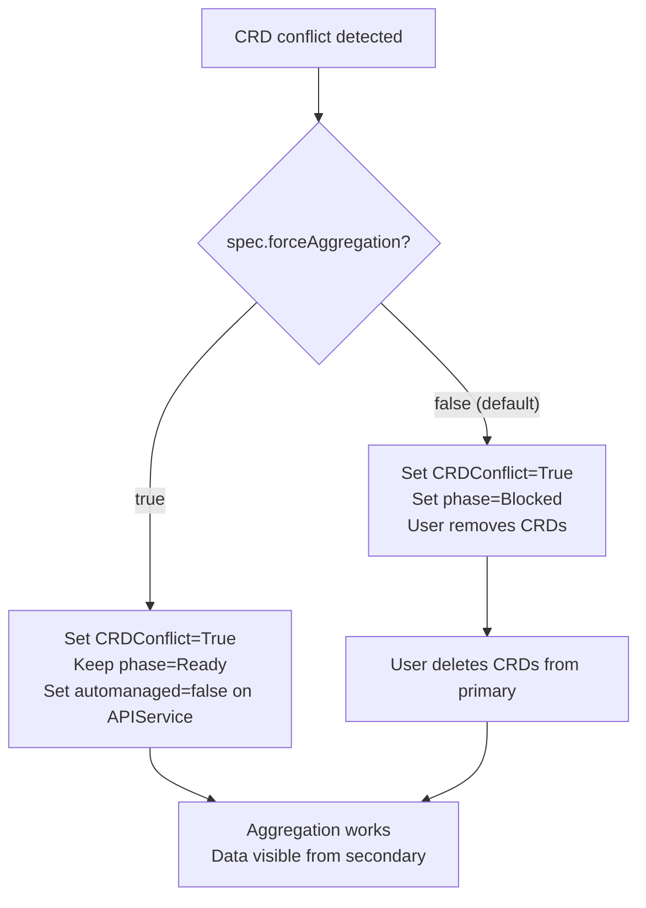

# Add `forceAggregation` Field to APIShard

## Background

When CRDs exist on the primary before the operator registers APIService objects, the kube-aggregator's autoRegisterController creates a "Local" APIService (labeled `automanaged: "true"`) that shadows aggregation. Currently the operator reports this as a conflict and blocks. With `forceAggregation: true`, the operator will override the auto-register controller by setting the label to `"false"` via SSA with ForceOwnership.

## Upstream Guarantee

From `kubernetes/staging/src/k8s.io/kube-aggregator/pkg/controllers/autoregister/autoregister_controller.go`:

```go
case !isAutomanaged(curr):
    return nil  // row 3: controller does nothing
```

`isAutomanaged()` returns `true` only for label values `"true"` or `"onstart"`. Setting it to `"false"` makes the controller ignore the APIService entirely.

## Changes

### 1. Add spec field

File: [`operator/api/v1alpha1/apishard_types.go`](operator/api/v1alpha1/apishard_types.go)

Add to `APIShardSpec`:

```go
// ForceAggregation, when true, causes the operator to override the
// kube-aggregator auto-register controller by explicitly marking
// APIService objects as not auto-managed. This allows aggregation
// to work even when CRDs exist on the primary for the same API groups.
// When false (default), the operator reports the conflict and sets
// phase to Blocked, leaving remediation to the user.
// +kubebuilder:default=false
ForceAggregation bool `json:"forceAggregation,omitempty"`
```

### 2. Update APIService apply to include label when force is enabled

File: [`operator/internal/aggregation/apiservice.go`](operator/internal/aggregation/apiservice.go)

- Add a `forceAggregation bool` parameter to `Reconcile()`
- When `forceAggregation == true`, include `metadata.labels: {"kube-aggregator.kubernetes.io/automanaged": "false"}` in the APIService object before SSA apply
- SSA with `ForceOwnership` will steal the label field from the auto-register controller, preventing flapping

### 3. Update conflict detection behavior when force is enabled

File: [`operator/internal/controller/apishard/reconciler.go`](operator/internal/controller/apishard/reconciler.go)

When `shard.Spec.ForceAggregation == true`:
- Still run `DetectCRDConflicts()` and report `CRDConflict=True` condition (for observability)
- Do NOT set phase to `Blocked` — the operator is handling the conflict
- Still sync CRDs to secondary (needed for serving)
- Change the condition message to indicate force mode is active (e.g., "CRDs exist on primary; aggregation forced via forceAggregation=true")

When `shard.Spec.ForceAggregation == false` (default):
- Current behavior unchanged: report conflict, set phase Blocked, wait for user to remove CRDs

### 4. Pass `forceAggregation` through the call chain

File: [`operator/internal/controller/apishard/reconciler.go`](operator/internal/controller/apishard/reconciler.go) in `reconcileAPIServices()`

Pass `shard.Spec.ForceAggregation` to `aggregation.Reconcile()`.

### 5. Regenerate CRD manifests

Run `make manifests` to update the CRD YAML with the new field.

### 6. Tests

- Unit test: verify APIService includes automanaged label when forceAggregation=true
- Unit test: verify phase is NOT Blocked when forceAggregation=true and CRDs conflict
- E2e test: install CRD first, create APIShard with forceAggregation=true, verify aggregation works without manual intervention

## Behavioral Summary


